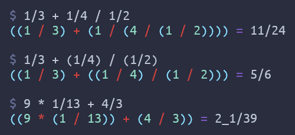

# fractjonal-calculator

For compsci, we were supposed to make a fractional calculator. Naturally, I
looked for
[a way to cheese the assignment. See Nashorn.java](https://github.com/coarchive/cs-java/blob/master/FracCalc/Nashorn.java).

But since that kinda defeated the point of the assignment, I did end up having
to do it for real. See [FracCalc.java](https://github.com/coarchive/cs-java/blob/master/FracCalc/FracCalc.java). I still wasn't satisfied with my Java version. With
[Joshua](https://github.com/legodude17)'s help,
I was able to read and understand the architecture of [a popular open source JavaScript parser named acorn](https://github.com/acornjs/acorn/tree/master/acorn/src).
Joshua also helped me debug a lot of this when it was broken and showed me how
to make a basic Makefile. This is the first time I ever used make. It's been
invaluable to me since then.
[Click for curse](https://github.com/coalpha/uml-jenerate/blob/master/Makefile).

This fractional calculator can handle order of operations for the operators
`+`, `-`, `*`, `/`, and `_`. It also understands parens.
